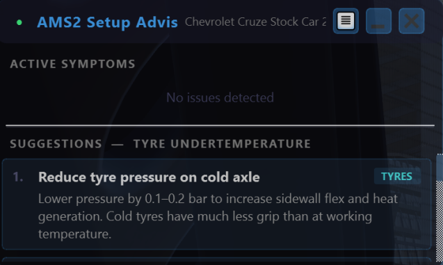

# AMS2 Setup Advisor

A real-time setup advisor overlay for **Automobilista 2**. Reads telemetry from the CREST2 shared memory server, detects handling symptoms as you drive, and surfaces prioritised setup change suggestions in an always-on-top overlay — no internet connection or AI required.



---

## Features

- **Real-time symptom detection** — understeer, oversteer, traction loss, brake instability, wheel lock, tyre temperatures, suspension bottoming, and ABS calibration issues
- **Prioritised suggestions** — each symptom maps to a ranked list of setup changes with plain-English explanations of *why* each change helps
- **Run-aware persistence** — suggestions accumulate from the moment you cross the start line and stay visible in the pit box; the log resets when you next leave the garage
- **Fully offline by default** — rule-based engine, no API keys, no cloud dependency
- **Optional AI mode** — opt-in Claude integration for more contextual analysis (requires your own Anthropic API key)
- **Minimal footprint** — transparent overlay, draggable, collapsible to a title bar

---

## Requirements

- **Automobilista 2** with **CREST2** running (CREST2 is available at [CREST2](https://github.com/viper4gh/CREST2-AMS2)
- **Python 3.10+**

### Python dependencies

```
pip install PyQt5 requests
```

Optional (only needed for AI mode):
```
pip install anthropic
```

Optional (only needed for the development mock server):
```
pip install flask
```

---

## Quick start

1. Launch CREST2 (`CREST2.exe` in your AMS2 install folder)
2. Launch AMS2 and get into a session
3. Run the overlay:
   ```
   python main.py
   ```

Verify CREST2 is reachable by opening `http://localhost:8180/crest2/v1/api` in a browser — you should see a JSON response. The overlay will show a green dot in the header when connected.

---

## Usage

### Overlay controls

| Control | Action |
|---|---|
| Drag anywhere on the window | Move overlay |
| `☰` button | Open settings (opacity, AI mode) |
| `—` button | Collapse to title bar |
| `✕` button | Close |

### Reading the overlay

The overlay has two panels:

- **Active Symptoms** — symptoms detected during the current run, colour-coded by severity (red = high, orange = medium, blue = low). Symptoms persist until the next garage exit.
- **Suggestions** — click any symptom to see the top 3 ranked setup changes for that issue.

Suggestions only appear after the car has crossed the start/finish line for the first time. This avoids noise on the out-lap before tyres and brakes are up to temperature.

### Settings

Click `☰` to open settings:

- **Opacity** — adjust overlay transparency (20–100%)
- **AI Mode** — enable Claude-powered suggestions (requires an [Anthropic API key](https://console.anthropic.com/))

---

## Detected symptoms

| Symptom | What triggers it |
|---|---|
| Understeer (turn-in) | Yaw rate below 70% of bicycle-model expectation at corner entry |
| Understeer (exit) | Low lateral G under throttle while steering |
| Oversteer (entry) | Yaw rate above 145% of expected, low throttle |
| Oversteer (exit / snap) | Yaw rate above 145% of expected, on throttle |
| Traction loss | Rear wheels spinning >3 RPS faster than fronts under power |
| Brake instability | ABS firing while cornering, or >40°C left/right brake temp asymmetry |
| Wheel lock-up | Wheel RPS drops below 15% of expected during braking (no ABS) |
| ABS setting too low | Wheels still locking despite ABS being active |
| ABS too aggressive | ABS activating at moderate brake pressure on a straight |
| Tyre overheating | Tread temperature above 105°C (warning) or 115°C (critical) |
| Tyre undertemperature | Tread temperature below 60°C at racing speed |
| Suspension bottoming | Ride height below 15mm at any corner |

All thresholds are in `config.py` and can be tuned without touching detection logic.

---

## Architecture

```
CREST2 HTTP server (localhost:8180)
        │
        │  Single JSON request every 500ms
        ▼
  CRESTClient  (data_layer/crest_client.py)
        │
        │  TelemetrySnapshot (all sections merged)
        ▼
  SignalSmoother  (analysis/signal_smoother.py)
        │
        │  SmoothedSignals (5-sample rolling average)
        ▼
  SymptomDetector  (analysis/symptom_detector.py)
        │
        │  [Symptom, ...]
        ▼
  App controller  (main.py)
  — tracks garage/lap state
  — accumulates worst-severity symptom per type
  — clears log on garage exit
        │
        ▼
  OverlayWindow  (ui/)
  SymptomPanel + SuggestionPanel
```

### Module overview

| Module | Purpose |
|---|---|
| `main.py` | Entry point, run-state machine, symptom accumulation |
| `config.py` | All tunable thresholds and UI constants |
| `data_layer/crest_client.py` | CREST2 polling, threading, connection state |
| `data_layer/data_models.py` | Typed dataclasses + JSON parsers for all CREST2 sections |
| `analysis/signal_smoother.py` | Rolling-average filter, derived signals (yaw model, spin delta) |
| `analysis/symptom_detector.py` | Rule engine: SmoothedSignals → list[Symptom] |
| `analysis/suggestion_table.py` | Offline lookup: SymptomType → ranked SuggestionEntry list |
| `ui/overlay_window.py` | Frameless always-on-top PyQt5 window |
| `ui/symptom_panel.py` | Scrollable symptom list with severity colouring |
| `ui/suggestion_panel.py` | Ranked suggestion cards with category badges |
| `ui/settings_dialog.py` | Opacity + AI mode configuration |
| `ai_layer/claude_advisor.py` | Optional Claude integration (graceful no-op if unavailable) |

---

## Development

### Running tests

```
python -m pytest tests/ -v
```

### Mock CREST2 server

Lets you develop and test without a running game:

```
pip install flask
python tests/mock_crest_server.py --scenario understeer
```

Available scenarios: `idle`, `understeer`, `oversteer`, `traction`, `braking`, `tyre_hot`, `tyre_cold`, `bottoming`

Switch scenario at runtime:
```
curl -X POST http://localhost:8180/scenario/oversteer
```

### Debug mode

Prints live signal values to the console each poll cycle — useful for verifying telemetry field mappings:

```
python main.py --debug
```

Output includes: speed, steering, throttle, brake, yaw rate, expected yaw, lateral G, per-wheel RPS, tyre tread temperatures, ABS/TC flags, and raw angular velocity / local acceleration components.

### Packaging (Windows executable)

```
pip install pyinstaller
pyinstaller --onefile --windowed --name "AMS2SetupAdvisor" main.py
```

Output: `dist/AMS2SetupAdvisor.exe` (~30–50 MB, no Python required).

---

## Configuration

All detection thresholds live in `config.py`. Key values:

| Constant | Default | Effect |
|---|---|---|
| `POLL_INTERVAL_MS` | 500 | How often telemetry is fetched |
| `SMOOTHER_WINDOW` | 5 | Samples to average (higher = less noise, more latency) |
| `MIN_SPEED_CORNER_KPH` | 40 | Below this, no cornering symptoms are raised |
| `UNDERSTEER_STEERING_THRESHOLD` | 0.20 | Minimum steering input to check for understeer |
| `UNDERSTEER_YAW_DEFICIT_RATIO` | 0.70 | Actual/expected yaw ratio below which understeer fires |
| `OVERSTEER_YAW_EXCESS_RATIO` | 1.45 | Actual/expected yaw ratio above which oversteer fires |
| `TYRE_OPTIMAL_LOW_K` | 333.15 K (60°C) | Undertemp threshold |
| `TYRE_OVERHEAT_K` | 388.15 K (115°C) | Critical overtemp threshold |
| `RIDE_HEIGHT_FLOOR_MM` | 15.0 | Ride height below which bottoming is flagged |
| `WHEEL_LOCK_RPS_RATIO` | 0.15 | Fraction of expected RPS below which a wheel is considered locked |

---

## VR

The overlay renders as a standard desktop window and will not appear inside the headset by default. Options:

- **OVR Toolkit** or **XSOverlay** — capture the overlay as a desktop window and project it into SteamVR (recommended, no code changes needed)
- **Second monitor** — position the overlay on a screen visible while in VR
- **Native OpenVR overlay** — possible via `pyopenvr` but requires significant additional work

---

## Linux / Steam Deck

The Python code is cross-platform. CREST2 is a Windows binary but may run under Proton/Wine. Once the CREST2 HTTP endpoint responds at `localhost:8180`, the overlay should work without modification. Known considerations:

- Wayland: always-on-top may be unreliable; use an X11/XWayland session if the overlay disappears behind the game window
- `pythonw` does not exist on Linux; use `python main.py &` or a `.desktop` launcher instead

---

## Acknowledgements

- [CREST2-AMS2](https://github.com/Cygon/crest2-ams2) — shared memory HTTP bridge for Automobilista 2
- Reiza Studios — Automobilista 2
